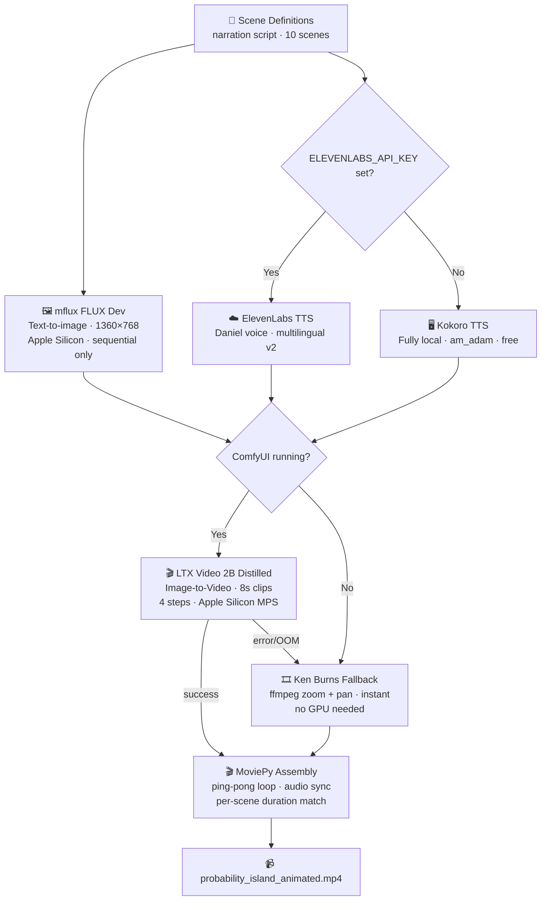

# Gurukul AI — Kids Educational Video Pipeline



## Setup

```bash
pip install -r requirements.txt
brew install ffmpeg
python download_models.py        # downloads LTX Video + T5 encoder (~9 GB)
```

Start ComfyUI on port 8288:
```bash
cd /path/to/ComfyUI && python main.py --port 8288 --preview-method none
```

## Run

```bash
python gurukul_island.py --scenes      # generate scene images
python gurukul_island.py --tts         # generate narration audio
python wan_animate.py --full           # animate + assemble final video
```

Single scene test:
```bash
python wan_animate.py --test
```

Static version (no ComfyUI needed):
```bash
python gurukul_island.py --showcase
```
