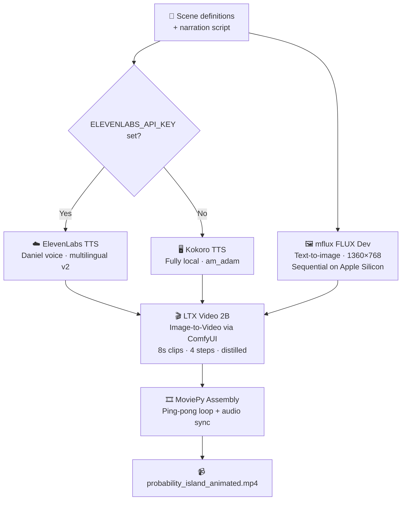

# Gurukul AI — Kids Educational Video Pipeline


Fully local AI pipeline that generates animated educational kids videos.
Cinematic Pixar-style landscape scenes + neural TTS narration + LTX Video animation.
Runs entirely on Apple Silicon M-series Macs. No cloud GPU needed.

---

## What it produces

**Probability Island** — a ~4-minute animated educational video for kids that teaches probability through 10 cinematic Pixar-style scenes: Coin Cliffs, Dice Plains, Enchanted Forest, and more. Each scene is animated with LTX Video and narrated by a warm AI voice.

---

## Pipeline Overview



---

## Hardware Requirements

| Component | Minimum | Tested on |
|-----------|---------|-----------|
| Chip | Apple M3 | M4 Max |
| RAM | 32 GB | 36 GB |
| Storage | 30 GB free | — |
| OS | macOS 14+ | macOS 15 |

> **Never run mflux in parallel.** Apple Silicon MPS does not support concurrent model instances. Always generate images sequentially.

---

## Setup

### 1. Clone and install Python dependencies

```bash
git clone https://github.com/LakshmiSravyaVedantham/gurukul-ai.git
cd gurukul-ai
pip install -r requirements.txt
brew install ffmpeg   # if not already installed
```

### 2. ElevenLabs API key (optional — falls back to local Kokoro)

Create `.env` in the repo root:
```
ELEVENLABS_API_KEY=your_key_here
```

### 3. ComfyUI

```bash
git clone https://github.com/comfyanonymous/ComfyUI.git /path/to/ComfyUI
cd /path/to/ComfyUI
python -m venv venv && source venv/bin/activate
pip install -r requirements.txt
```

Update `COMFYUI_DIR` in `wan_animate.py` to point to your ComfyUI folder.

Start ComfyUI on port 8288 (keep running while animating):
```bash
python main.py --port 8288 --preview-method none
```

### 4. Download LTX Video models (~9 GB total, run once)

```bash
python download_models.py
```

| File | Size | Destination |
|------|------|-------------|
| `ltxv-2b-0.9.8-distilled-fp8.safetensors` | 4.2 GB | `ComfyUI/models/checkpoints/` |
| `t5xxl_fp8_e4m3fn.safetensors` | 4.6 GB | `ComfyUI/models/text_encoders/` |

> If you already have FLUX installed, `t5xxl_fp8_e4m3fn.safetensors` is likely already in your HuggingFace cache (`~/.cache/huggingface`) and will be copied automatically.

---

## Running the Pipeline

```bash
# Step 1 — Generate 10 Pixar-style scene images (~8 min, sequential)
python gurukul_island.py --scenes

# Step 2 — Generate narration audio (ElevenLabs or Kokoro fallback)
python gurukul_island.py --tts

# Step 3 — Animate all scenes with LTX Video (~10-15 min/scene on M4 Max)
#           Requires ComfyUI running on port 8288
python wan_animate.py --all

# Step 4 — Assemble final video
python wan_animate.py --assemble

# Or run everything at once
python gurukul_island.py --all && python wan_animate.py --full
```

### Quick test (single scene)

```bash
python wan_animate.py --test    # animates scene 02 only, opens preview
```

### Static version (no animation, instant)

```bash
python gurukul_island.py --showcase
```

---

## Project Structure

```
gurukul-ai/
├── gurukul_island.py       # Scene generation + TTS + static showcase
├── wan_animate.py          # LTX Video animation + final assembly
├── download_models.py      # One-time model download helper
├── requirements.txt
├── .env                    # ELEVENLABS_API_KEY (not committed)
└── output/                 # Generated files (gitignored)
    ├── island_scenes/      # FLUX-generated PNGs
    ├── island_audio/       # TTS WAV files
    ├── island_clips/       # LTX Video animated clips
    └── probability_island_animated.mp4
```

---

## Models Used

| Model | Purpose | Source |
|-------|---------|--------|
| FLUX Dev (mflux) | Image generation | Auto-downloaded by mflux |
| LTX Video 2B distilled FP8 | Image-to-video animation | `Lightricks/LTX-Video` |
| T5-XXL FP8 | Text encoding for LTX Video | `comfyanonymous/flux_text_encoders` |
| ElevenLabs Daniel | Primary TTS narration | ElevenLabs API (`onwK4e9ZLuTAKqWW03F9`) |
| Kokoro am_adam | Fallback TTS — fully local | `kokoro` Python package |

---

## Tips

- **Regenerate one scene**: delete `output/island_clips/scene_XX.mp4` and re-run `--all`
- **Out of memory**: reduce `num_frames` in `wan_animate.py` (201 → 97 for 4s clips)
- **Change the topic**: edit `SCENE_DEFS`, `SCENES`, and `ANIMATION_PROMPTS` in the two scripts

---

## Tools Used

| Tool | Purpose | License |
|------|---------|---------|
| [mflux](https://github.com/filipstrand/mflux) | FLUX image generation on Apple Silicon | MIT |
| [LTX Video](https://github.com/Lightricks/LTX-Video) | Fast image-to-video on Apple Silicon | Apache 2.0 |
| [ComfyUI](https://github.com/comfyanonymous/ComfyUI) | LTX Video inference backend | GPL-3.0 |
| [ElevenLabs](https://elevenlabs.io) | Cloud TTS | Commercial API |
| [Kokoro TTS](https://huggingface.co/hexgrad/Kokoro-82M) | Local neural TTS | Apache 2.0 |
| [MoviePy](https://zulko.github.io/moviepy/) | Video assembly | MIT |

---

## License

MIT
