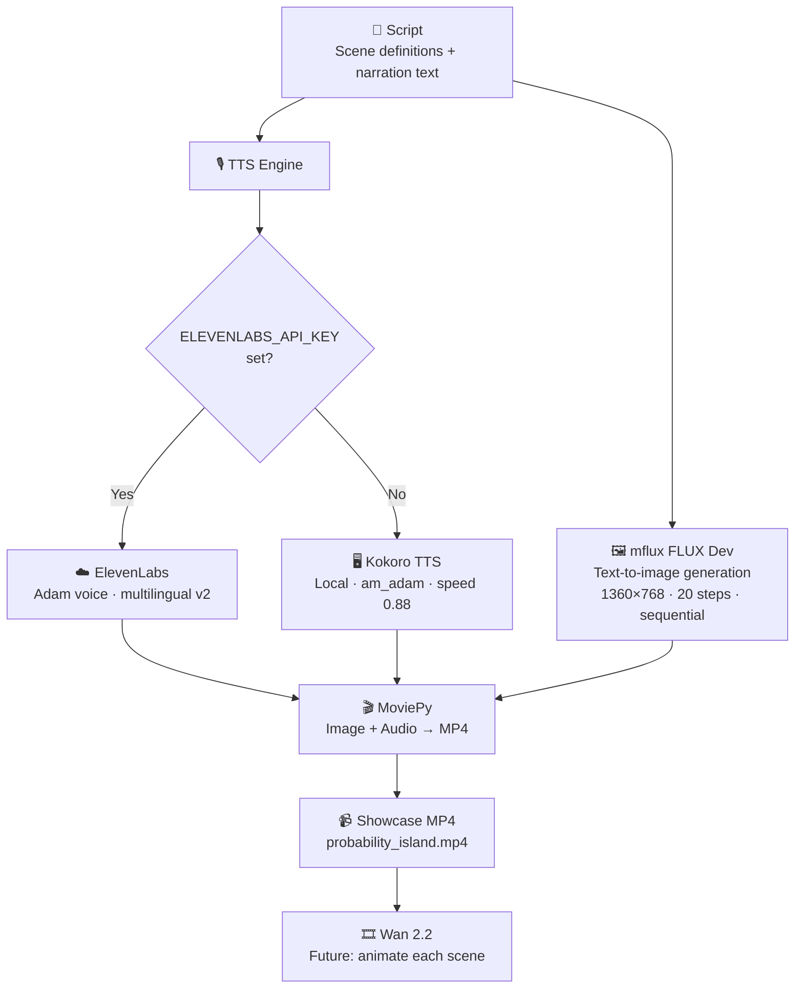

# Gurukul AI — Kids Educational Video Pipeline


Fully local AI pipeline that generates educational kids videos — cinematic Pixar-style landscapes + neural TTS narration. Runs on Apple Silicon M-series Macs.

---

## Pipeline Overview



---

## Visual Styles

| Style | Description | Best for |
|-------|-------------|----------|
| 🏝️ Probability Island | Cinematic landscapes — coin cliffs, dice plains, enchanted forest | Best visual quality, zero consistency issues |
| ✏️ Chalk World | Dark chalkboard with chalk illustrations | Educational feel, text may hallucinate |
| ✨ Magic Objects | Dramatic studio close-ups of objects | Clean concept visuals |

---

## Hardware Requirements

| Component | Minimum | Recommended |
|-----------|---------|-------------|
| Chip | Apple Silicon M1 | M3 Max / M4 Max |
| RAM | 16GB | 36GB+ |
| Storage | 50GB free | 500GB+ (models) |
| OS | macOS 13+ | macOS 15+ |

> FLUX Dev at 1360×768 uses ~22 GB RAM on M4 Max. Schnell uses ~14 GB.

---

## Installation

```bash
# 1. Clone
git clone https://github.com/LakshmiSravyaVedantham/gurukul-ai
cd gurukul-ai

# 2. Create venv
python3 -m venv venv && source venv/bin/activate

# 3. Install dependencies
pip install mflux kokoro soundfile moviepy pillow elevenlabs numpy

# 4. (Optional) ElevenLabs for best voice quality
export ELEVENLABS_API_KEY=your_key_here   # skip to use free local Kokoro TTS

# 5. Run
python gurukul_island.py --all
```

Also requires `ffmpeg` on your system:

```bash
brew install ffmpeg
```

> Models download automatically on first run: FLUX Dev (~30 GB), Kokoro (~500 MB). Run once with internet, then fully offline.

---

## Usage

```bash
python gurukul_island.py --scenes    # generate 10 scenes (~40 min, dev model)
python gurukul_island.py --tts       # generate narration audio
python gurukul_island.py --showcase  # assemble MP4
python gurukul_island.py --all       # full pipeline end-to-end
```

Output files land in `output/island_scenes/`, `output/island_audio/`, and `output/probability_island.mp4`.

---

## TTS: ElevenLabs + Kokoro Fallback

ElevenLabs is used when `ELEVENLABS_API_KEY` is set in your environment (best quality — Adam voice, multilingual v2). If not set or if the API call fails, it automatically falls back to **Kokoro TTS** — a fully local, free, high-quality neural TTS that runs on CPU/Apple Silicon with no API key required.

---

## Important Notes

> ⚠️ **Never run multiple mflux instances in parallel on Apple Silicon.** They share the Metal GPU and will silently crash each other. Always use sequential generation (the pipeline handles this automatically).

---

## Project Structure

```
gurukul-ai/
├── gurukul_island.py      # Main pipeline — Probability Island style (10 cinematic scenes)
├── gurukul_v3.py          # img2img with characters (reference)
├── gurukul_v2.py          # older attempt (reference)
├── output/                # generated images, audio, video (gitignored)
│   ├── island_scenes/
│   ├── island_audio/
│   └── probability_island.mp4
└── README.md
```

---

## Roadmap

- [x] Script + scene definitions (Probability Island, 10 scenes)
- [x] mflux FLUX Dev image generation (cinematic 1360×768)
- [x] Kokoro TTS narration (am_adam, warm narrator voice)
- [x] ElevenLabs TTS with automatic Kokoro fallback
- [x] MoviePy showcase assembly
- [ ] Wan 2.2 animation of each scene
- [ ] More topics: Fractions, Geometry, Algebra
- [ ] Hindi narration support
- [ ] YouTube auto-upload

---

## Tools Used

| Tool | Purpose | License |
|------|---------|---------|
| [mflux](https://github.com/filipstrand/mflux) | FLUX Dev/Schnell image generation on Apple Silicon | MIT |
| [FLUX.1-Dev](https://huggingface.co/black-forest-labs/FLUX.1-dev) | Image generation model | FLUX Non-Commercial |
| [ElevenLabs](https://elevenlabs.io) | Cloud TTS — Adam voice, multilingual v2 | Commercial API |
| [Kokoro TTS](https://huggingface.co/hexgrad/Kokoro-82M) | Local neural TTS narration | Apache 2.0 |
| [MoviePy](https://zulko.github.io/moviepy/) | Video assembly | MIT |
| [Wan 2.2](https://github.com/Wan-Video/Wan2.1) | Image-to-video animation (upcoming) | Apache 2.0 |

---

## License

MIT
