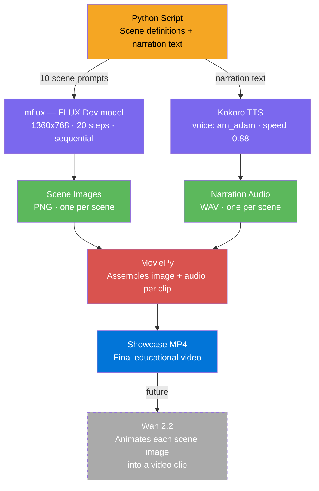

# Gurukul AI — Kids Educational Video Pipeline

A fully local, free, Apple Silicon pipeline for generating educational kids videos on NCERT math topics. No cloud APIs. No subscription fees. Runs entirely on your Mac.

Current topic: **Probability (Class 6 NCERT)** — rendered in the *Probability Island* style.

---

## Pipeline Overview



---

## Visual Styles

Three styles have been explored. The best results use **Probability Island**.

| Style | Description | Status |
|---|---|---|
| **Probability Island** | Cinematic landscape — no characters. Each scene IS the concept (coin cliffs, dice plains, glowing fruit forest). Zero character consistency issues. | **BEST — use this** |
| **Chalk World** | Hand-drawn chalk-on-blackboard aesthetic. Concepts illustrated as chalk diagrams. | Reference only |
| **Magic Objects** | Floating magical props (coins, dice, bags) in a stylized world. | Reference only |

---

## Hardware Requirements

| Component | Minimum | Recommended |
|---|---|---|
| Chip | Apple Silicon (M1/M2/M3/M4) | M4 Max |
| RAM | 16 GB | **36 GB** (for FLUX Dev) |
| Storage | 50 GB free | 100 GB free |
| OS | macOS 13+ | macOS 15+ |

> FLUX Dev at 1360x768 uses ~22 GB RAM on M4 Max. Schnell uses ~14 GB.

---

## Installation

### 1. Set up mflux (FLUX image generation)

```bash
# Create a virtual environment
python3 -m venv venv
source venv/bin/activate

# Install mflux
pip install mflux

# Models download automatically on first run (~30 GB for Dev, ~6 GB for Schnell)
# Dev model path: ~/.cache/huggingface/hub/models--black-forest-labs--FLUX.1-dev
```

### 2. Set up Kokoro TTS

```bash
pip install kokoro soundfile numpy
```

Kokoro runs fully offline after the first model download (~500 MB).

### 3. Set up MoviePy

```bash
pip install moviepy
```

Also requires `ffmpeg` on your system:

```bash
brew install ffmpeg
```

---

## Usage

### Probability Island (recommended)

```bash
# Activate your venv first
source venv/bin/activate

# Generate all 10 scene images (~8 min on M4 Max with Dev model)
python gurukul_island.py --scenes

# Generate narration audio for all 10 scenes
python gurukul_island.py --tts

# Assemble the final MP4 showcase
python gurukul_island.py --showcase

# Run everything end-to-end
python gurukul_island.py --all
```

Output files land in `output/island_scenes/`, `output/island_audio/`, and `output/probability_island.mp4`.

### Reference scripts (older approaches)

```bash
# v3: img2img with guru + kid characters (kept for reference)
python gurukul_v3.py --all

# v2: older attempt (kept for reference)
python gurukul_v2.py --all
```

---

## Project Structure

```
ai_edu/
├── gurukul_island.py      # BEST — Probability Island style (10 cinematic scenes)
├── gurukul_v3.py          # img2img with characters (reference)
├── gurukul_v2.py          # older attempt (reference)
├── output/                # generated images, audio, video (gitignored)
│   ├── island_scenes/
│   ├── island_audio/
│   └── probability_island.mp4
└── README.md
```

---

## Notes

**Never run mflux in parallel on Apple Silicon.** Always generate scenes sequentially — one at a time. Parallel runs cause memory spikes that crash the process or produce corrupted outputs.

The pipeline handles this correctly: `gurukul_island.py` loops through scenes one by one in `generate_all_scenes()`.

---

## Roadmap

- [x] Script + scene definitions (Probability Island, 10 scenes)
- [x] mflux FLUX Dev image generation (cinematic 1360x768)
- [x] Kokoro TTS narration (am_adam, warm narrator voice)
- [x] MoviePy showcase assembly
- [ ] Wan 2.2 animation — animate each scene image into a short video clip
- [ ] Background music track
- [ ] Additional NCERT topics (Fractions, Geometry, Ratios)
- [ ] Hindi narration voice

---

## Tools Used

| Tool | Purpose | License |
|---|---|---|
| [mflux](https://github.com/filipstrand/mflux) | FLUX Dev/Schnell image generation on Apple Silicon | MIT |
| [FLUX.1-Dev](https://huggingface.co/black-forest-labs/FLUX.1-dev) | Image generation model | FLUX Non-Commercial |
| [Kokoro TTS](https://huggingface.co/hexgrad/Kokoro-82M) | Text-to-speech narration | Apache 2.0 |
| [MoviePy](https://zulko.github.io/moviepy/) | Video assembly | MIT |
| [Wan 2.2](https://github.com/Wan-Video/Wan2.1) | Image-to-video animation (upcoming) | Apache 2.0 |

All tools run **fully locally** — no API keys, no internet required after initial model downloads.
