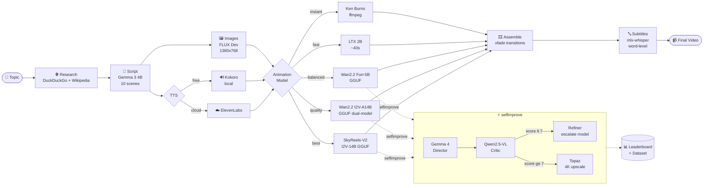

# Gurukul AI — Kids Educational Video Pipeline

> Fully local, free, Apple Silicon. No cloud APIs needed.
> Generates Pixar-style animated educational videos end-to-end.

**🌐 [gurukul-ai.vercel.app](https://web-five-lime-42.vercel.app)** &nbsp;|&nbsp; 

## Pipeline Overview



## Features

| Feature | Tool | Cost |
|---|---|---|
| Script generation | Gemma 3 4B (mlx-lm) | Free |
| Topic research | DuckDuckGo + Wikipedia | Free |
| Image generation | FLUX Dev (mflux) | Free |
| Narration TTS | Kokoro am_adam | Free |
| Animation | LTX 2B / LTX 13B / LTX-2.3 / Wan2.2 Fun / Wan2.2 I2V / SkyReels-V2 | Free |
| Prompt expansion | Gemma 4 26B (mlx-lm) | Free |
| Video scoring | Qwen2.5-VL 7B (mlx-vlm) | Free |
| Word subtitles | mlx-whisper (Whisper Small) | Free |
| Scene transitions | ffmpeg xfade | Free |
| 4K upscale | Topaz Video AI (optional) | Paid app |

## ⚡ /selfimprove — Agentic Pipeline

5-stage self-improving loop that auto-escalates to better models until quality passes:

```
Director (Gemma 4) → Creator → Critic (Qwen2.5-VL scores 1-10) → Refiner → Polisher (Topaz 4K)
```

Escalation order: `LTX-2B → Wan2.2 Fun-5B GGUF → LTX-13B → Wan2.2 I2V-A14B GGUF → SkyReels-V2 I2V-14B GGUF`

```bash
# Single model
python agentic_pipeline.py "coin slowly flipping" --scene 3 --model ltx-2b

# Benchmark all models + build leaderboard
python agentic_pipeline.py "coin slowly flipping" --scene 3 --models all

# View leaderboard
python agentic_pipeline.py --leaderboard
```

## Setup

```bash
# Clone and install
pip install -r requirements.txt
brew install ffmpeg

# Start the Gradio app
python app.py
# → Open http://localhost:7860
```

Start ComfyUI on port 8288 for video generation:
```bash
cd /path/to/ComfyUI && python main.py --port 8288 --preview-method none
```

## Models

| Stage | Model | Size | Format |
|---|---|---|---|
| Script | Gemma 3 4B | ~2.5 GB | MLX 4-bit |
| Director | Gemma 4 26B | ~14 GB | MLX 4-bit MoE |
| Critic | Qwen2.5-VL 7B | ~4 GB | MLX 4-bit |
| Animation (fast) | LTX Video 2B | ~4 GB | ComfyUI |
| Animation (quality) | LTX-2.3 22B | ~16 GB | GGUF Q4_0 |
| Animation (objects) | Wan2.2 Fun-5B | ~5 GB | GGUF Q8_0 |
| Animation (quality) | Wan2.2 I2V-A14B | ~20 GB | GGUF dual |
| Animation (best) | SkyReels-V2 I2V-14B | ~10 GB | GGUF Q5_K_M |
| Subtitles | Whisper Small | ~150 MB | MLX |
| Images | FLUX Dev | ~16 GB | MLX BF16 |

## Quick commands

```bash
# Generate a new topic
python generate_topic.py "fractions"           # researches topic + writes script

# Add subtitles to any video
python subtitles.py output/animated.mp4

# Run web research only
python web_research.py "black holes"

# Assemble with xfade transitions
python assemble_video.py --all
```
